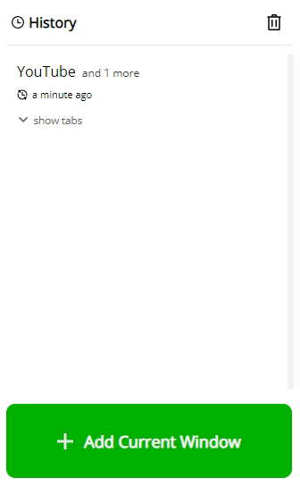
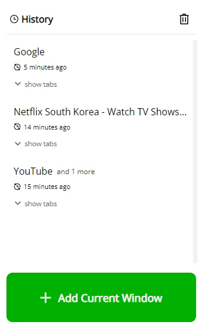
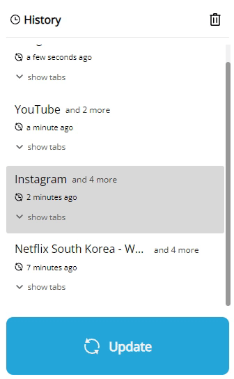
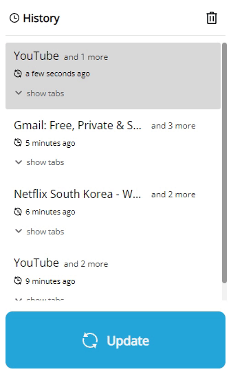

#  SnapShotTabs

chrome extension to help save and open many tabs at a time.

## Features

- Add current window as a snapshot
- Update snapshot
- Delete snapshots
- Download & Upload data files locally
- Sorted by last updated / time shown as relative

## Screenshots

### Popup

<table>
	<tr>
		<th width="50%">
			

			
Add
		<th width="50%">
			

      
Open
  <tr>
    <th width="50%">
			

      
Update
    <th width="50%">
			

      
Delete
</table>

### Options

### more

- [Moment.js](https://momentjs.com/) library used
- icons from [iconmonstr.com](https://iconmonstr.com/)

